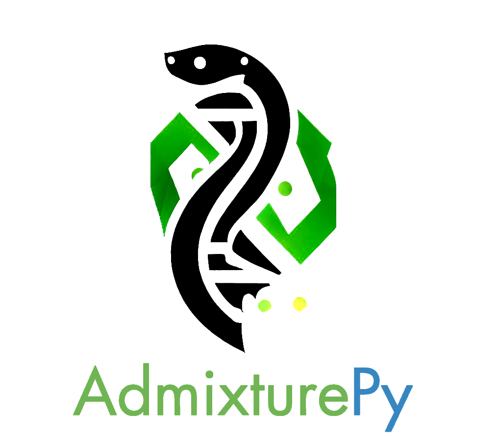

#      

A set of admixture tools written in Python with a JavaScript frontend.

### Features

* Monte-Carlo Simulation in Python (sped up using numba) to estimate Global25 ancestry
* Distance calculator
* 2D PCA analysis
* Loading and saving models through JSON
* Complete API access to the G25 database
* Implemented in Flask
* Lightweight, and easily deployable
* Sleek and clean UI implemented using Bootstrap 4

### Yet to be implemented

* Custom samples
* CUDA implementation of nMonte to speed up calculations
* 3D PCA analysis
